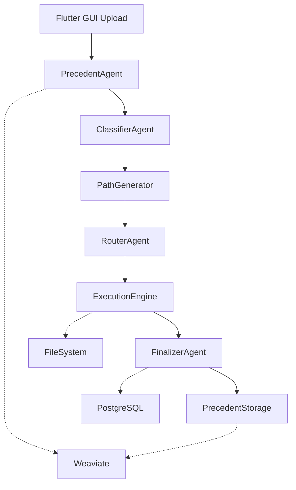

# Genesis AI Assistant

A sophisticated multimodal AI assistant with LangGraph orchestration, Weaviate vector storage, and smart precedent learning. Genesis processes images, audio, documents, and more using locally-hosted OpenAI gpt-oss models through Ollama.

## What Genesis Can Do

- **AI-Powered Document Processing**: Advanced OCR with PaddleOCR, intelligent text merging, translation, and extraction from images and PDFs
- **Image Processing**: Text removal, inpainting with custom fonts, and intelligent image manipulation
- **Audio Processing**: Noise reduction and audio enhancement using advanced algorithms  
- **Smart Workflow Learning**: Weaviate-powered precedent system that learns from your processing patterns
- **Web Search Integration**: Built-in web search capabilities for enhanced AI responses
- **Real-time Processing**: WebSocket support for live updates and streaming execution
- **Cross-Platform GUI**: Flutter-based interface supporting Windows, macOS, Linux, Web, iOS, and Android
- **Full-Stack Architecture**: Python backend with FastAPI, Flutter frontend with Dart

## Quick Start Guide

[**🎬 Watch the Genesis Demo →**](https://youtu.be/3ptw_qFj6xo)

### Step 1: Install Prerequisites

#### Required Software
1. **[Ollama](https://ollama.com/download)** - Download and install for your operating system
2. **[Docker Desktop](https://www.docker.com/products/docker-desktop/)** - Install Docker and Docker Compose
3. **[Flutter SDK](https://flutter.dev/docs/get-started/install)** - Required for running the GUI
4. **[Git](https://git-scm.com/downloads)** - For cloning the repository

#### Optional (for local development)
- Python 3.12+ (for backend development)
- Visual Studio Code or Android Studio (for Flutter development)

### Step 2: Clone and Setup Project

```bash
# Clone the repository
git clone <your-repository-url>
cd Genesis

# Make sure Docker is running
docker --version
docker-compose --version
```

### Step 3: Download AI Models

Genesis requires OpenAI's gpt-oss models. After installing Ollama:

```bash
# Start Ollama (if not already running)
ollama serve

# In a new terminal, download the AI model
# Option A: Smaller model (14GB, requires 16GB+ RAM) - RECOMMENDED
ollama pull gpt-oss:20b

# Option B: Larger model (65GB, requires 80GB+ memory) - For advanced users
# ollama pull gpt-oss:120b

# Verify the model downloaded successfully
ollama list
```

**Important**: The model download may take 10-30 minutes depending on your internet speed.

### Step 4: Configure Environment

Create your environment files:

#### Create `.env` in project root:
```env
# === Required Configuration ===
GENESIS_KEEP_WORKSPACE=1
GENESIS_DEV_MODE=0

# === Jina AI API (Optional - for enhanced reranking) ===
# Get your free API key from https://jina.ai/ (no registration required)
# JINA_AI_API_KEY=your_jina_api_key

# === Optional API Keys (for enhanced functionality) ===
# GOOGLE_API_KEY=your_google_api_key
# BRAVE_API_KEY=your_brave_search_api_key
# SERPER_API_KEY=your_google_serper_api_key
```

#### Configure Flutter GUI:
The Flutter GUI is pre-configured to connect to `http://localhost:8000`. No additional configuration needed for local development.

### Step 5: Start Genesis

Choose your deployment mode:

#### Option A: Standard Setup (Recommended)
```bash
# Start all services
docker-compose up -d

# View logs to ensure everything started correctly
docker-compose logs -f

# When everything is running, you should see:
# ✓ Database connected
# ✓ Ollama model loaded
# ✓ Frontend and backend ready
```

#### Option B: GPU Mode (CUDA 12.8 Only - Experimental)
⚠️ **Warning**: GPU mode is experimental and only supports CUDA 12.8. May have compatibility issues with other CUDA versions.

**Requirements:**
- NVIDIA GPU with 12GB+ VRAM
- CUDA 12.8 compatible drivers
- NVIDIA Docker runtime installed

```bash

# If the test passes, start Genesis with GPU support
docker-compose -f docker-compose.yml -f docker-compose.gpu.yml up -d

# Monitor logs for GPU initialization
docker-compose -f docker-compose.yml -f docker-compose.gpu.yml logs -f backend
```

### Step 6: Build and Run Flutter GUI

The Flutter GUI needs to be built and run separately:

```bash
# Navigate to the gui directory
cd gui

# Get Flutter dependencies
flutter pub get

# Run the app (choose your platform)
flutter run -d windows    # For Windows
flutter run -d macos      # For macOS
flutter run -d linux      # For Linux
flutter run -d chrome     # For Web browser

# Or build release version
flutter build windows
flutter build macos
flutter build linux
flutter build web
```

### Step 7: Access Genesis

Once backend is running and Flutter GUI is launched:

- **🌟 Genesis GUI**: Runs as native desktop/mobile/web app
- **📚 API Documentation**: http://localhost:8000/docs
- **🔧 Backend API**: http://localhost:8000
- **🗄️ Weaviate Console**: http://localhost:8080/v1

### Step 8: Test Your Setup

1. **Launch the Flutter GUI** and create a new chat
2. **Upload a Test Image**: Use `tests/examples/test.png`
3. **Try OCR**: Ask Genesis to extract text from the image
4. **Test Audio**: Upload `tests/examples/test.wav` and try denoising
5. **Experiment**: Try different combinations of tools and watch real-time execution in the UI

## Available Tools

Genesis provides these AI-powered tools:

### 🖼️ Image Processing
- **OCR**: Extract text from images and PDFs
- **Text Removal**: Intelligently erase text from images
- **Inpainting**: Replace text with custom fonts and styles
- **Translation**: Multi-language text translation

### 🎵 Audio Processing
- **Denoise**: Remove background noise from audio files

### 🌐 Web & Search
- **Web Search**: Search the internet using DuckDuckGo

### 📝 Workflow Examples
- **Document Digitization**: Image → OCR → Translate → Export
- **Image Cleanup**: Image → OCR → Remove Text → Save Clean Image
- **Audio Enhancement**: Audio → Denoise → Download Clean Audio

## How Genesis Works: Data Flow & Integrations

Genesis operates through a sophisticated orchestration system that intelligently processes your files and learns from your workflows:

### 🔄 **Simple Data Flow**



**Step-by-Step Process:**
1. **Input Analysis** → Upload files (images, audio, PDFs) via Flutter GUI
2. **Precedent Lookup** → Search Weaviate vector database for similar past workflows  
3. **Smart Classification** → AI analyzes content type and processing requirements
4. **Path Planning** → Generate optimal tool combinations based on input/output types
5. **Intelligent Routing** → Select best workflow path with learned preferences
6. **Execution** → Run processing tools (OCR, translation, audio processing, etc.)
7. **Real-time Updates** → Stream execution progress back to Flutter GUI via WebSocket
8. **Result Assembly** → Format outputs and save to organized file structure
9. **Learning** → Store successful workflow as precedent for future optimization
## Troubleshooting

### Genesis Won't Start

**Problem**: "Cannot connect to Ollama"
```bash
# Check if Ollama is running
ollama list

# If not running, start it
ollama serve

# Verify your model is available
ollama list | grep gpt-oss
```

**Problem**: "Flutter GUI can't connect to backend"
```bash
# Check if backend is running
docker-compose logs backend

# Verify backend is accessible
curl http://localhost:8000/health

# Check Flutter config (should point to http://localhost:8000)
# Edit gui/lib/core/config.dart if needed

# Restart services
docker-compose restart
```

**Problem**: Docker containers keep stopping
```bash
# Check Docker logs
docker-compose logs

# Make sure you have enough RAM (16GB+ recommended)
# Set GENESIS_DEV_MODE=0 in .env to prevent auto-reload issues
```

### Performance Issues

**Slow Processing**: 
- Ensure you're using the 20B model (not 120B) unless you have 80GB+ RAM
- Close other memory-intensive applications
- Consider using CPU mode instead of GPU mode

**First Run Slow**: 
- PaddleOCR models download on first OCR/translation use
- Subsequent runs will be much faster

### Flutter GUI Issues

**Problem**: "Flutter not found"
```bash
# Verify Flutter installation
flutter doctor

# If issues found, follow Flutter's setup guide
flutter doctor -v
```

**Problem**: "Dependencies failed to resolve"
```bash
cd gui
flutter clean
flutter pub get
```

**Problem**: "Platform not available"
```bash
# Check available devices
flutter devices

# Enable desktop support if needed
flutter config --enable-windows-desktop
flutter config --enable-macos-desktop
flutter config --enable-linux-desktop
```

### Getting Help

1. **Check logs**: `docker-compose logs -f`
2. **Verify setup**: Ensure Ollama is running with `ollama list`
3. **Restart services**: `docker-compose restart`
4. **Clean start**: `docker-compose down && docker-compose up -d`

## Advanced Configuration

### Vector Database (Weaviate)

Genesis uses Weaviate for vector storage and precedent learning:

- **Automatic Setup**: Weaviate runs automatically via Docker Compose
- **Data Persistence**: All precedent data is stored in Docker volumes
- **No Manual Configuration**: Everything is pre-configured to work locally
- **Access Console**: View stored precedents at http://localhost:8080/v1

### API Keys (Optional)

Enhance Genesis with additional services:

- **Jina AI**: Enhanced reranking capabilities (get free key from [jina.ai](https://jina.ai/) - no registration required)
- **Google Gemini**: Alternative AI model for certain tasks
- **Brave Search**: Enhanced web search capabilities  
- **Serper**: Google search integration

Add these to your `.env` file as needed.

### Development Mode

For developers who want to modify Genesis:

```bash
# Enable development mode with hot reload
# Set in .env: GENESIS_DEV_MODE=1

# Or run development compose
docker-compose -f docker-compose.yml -f docker-compose.dev.yml up -d
```

## System Requirements

### Minimum Requirements (Recommended Setup)
- **RAM**: 16GB (for gpt-oss:20b model)
- **Storage**: 20GB free space
- **CPU**: Any modern CPU with AVX2 support
- **OS**: Windows 10+, macOS 10.15+, or modern Linux

### High-Performance Setup
- **RAM**: 32GB+ 
- **Storage**: SSD with 50GB+ free space
- **CPU**: Multi-core processor (8+ cores recommended)

### GPU Requirements (Optional, Experimental)
- **GPU**: NVIDIA RTX 40/50 series with 12GB+ VRAM
- **CUDA**: Exactly CUDA 12.8 compatible drivers (other versions not supported)
- **RAM**: 24GB+ system RAM
- **Docker**: NVIDIA Docker runtime installed

## Support & Contributing

### Getting Support
- Check the troubleshooting section above
- Review Docker logs: `docker-compose logs`
- Ensure all prerequisites are properly installed

### Contributing
1. Fork the repository
2. Create a feature branch (`git checkout -b feature/amazing-feature`)
3. Test your changes thoroughly
4. Commit your changes (`git commit -m 'Add amazing feature'`)
5. Push to the branch (`git push origin feature/amazing-feature`)
6. Open a Pull Request

## License

This project is licensed under the Apache 2.0 License. The OpenAI gpt-oss models are also licensed under Apache 2.0.

---

## Project Structure (For Developers)

```
Genesis/
├── 📱 Frontend (Flutter + Dart)
│   └── gui/
│       ├── lib/
│       │   ├── main.dart         # Application entry point
│       │   ├── layout.dart       # Root layout with sidebar & panels
│       │   ├── core/             # Configuration
│       │   ├── data/             # Models and services
│       │   │   ├── models/       # Data models (messages, attachments)
│       │   │   └── services/     # API clients (chat, streaming, artifacts)
│       │   └── widgets/          # UI components
│       │       ├── chat/         # Chat interface components
│       │       ├── execution/    # Execution visualization
│       │       ├── previews/     # File preview components
│       │       └── common/       # Shared widgets
│       ├── assets/               # Static resources
│       ├── android/ios/linux/macos/windows/web/  # Platform configs
│       └── pubspec.yaml          # Flutter dependencies
├── 🔧 Backend (FastAPI + Python)
│   └── src/
│       ├── main.py               # FastAPI application entry point
│       ├── api/                  # REST API endpoints
│       │   ├── chat.py           # Chat management
│       │   ├── message.py        # Message handling
│       │   ├── artifact.py       # File artifacts
│       │   └── model.py          # AI model info
│       ├── db/                   # Database layer
│       │   ├── database.py       # PostgreSQL connection
│       │   ├── model.py          # SQLAlchemy models
│       │   ├── client.py         # Weaviate client setup
│       │   └── semantics.py      # Vector operations
│       └── orchestrator/         # LangGraph orchestration (see below)
├── 🧠 Orchestrator (LangGraph Workflow Engine)
│   └── src/orchestrator/
│       ├── core/                 # Core orchestration
│       │   ├── orchestrator.py   # Main coordinator
│       │   └── state.py          # Workflow state
│       ├── agents/               # AI agents
│       │   ├── classifier.py     # Input classification
│       │   ├── router.py         # Path routing
│       │   ├── finalizer.py      # Result assembly
│       │   ├── precedent.py      # Precedent learning
│       │   └── prompts/          # YAML prompt templates
│       ├── path/                 # Path planning system
│       │   ├── metadata.py       # Type system (WorkflowType, FileType)
│       │   ├── registry.py       # Tool discovery
│       │   └── generator.py      # Path generation (DFS)
│       ├── executor/             # Execution engine
│       │   └── execution.py      # LangGraph execution
│       ├── tools/                # Processing tools
│       │   ├── path_tools/       # OCR, translate, denoise, inpaint, erase
│       │   └── agent_tools/      # Web search, utilities
│       └── stream/               # WebSocket streaming
├── 🗄️ Data & Testing
│   ├── data/font/                # Font files for text inpainting
│   ├── inputs/                   # User uploads (by conversation)
│   ├── outputs/                  # Processing results (by conversation)
│   └── tmp/                      # Temporary files
├── 🐳 Deployment
│   ├── docker-compose.yml        # Main deployment (PostgreSQL, Weaviate, Backend)
│   ├── docker-compose.gpu.yml    # GPU variant (CUDA 12.8)
│   ├── docker-compose.dev.yml    # Dev mode with hot reload
│   ├── Dockerfile                # Backend container
│   ├── requirements-common.txt   # Python dependencies
│   ├── requirements-cpu.txt      # CPU-specific packages
│   └── requirements-gpu.txt      # GPU-specific packages
└── 📋 Documentation
    ├── README.md                 # This file
    ├── project_structure.md      # Detailed structure documentation
    └── .env                      # Environment configuration
```
