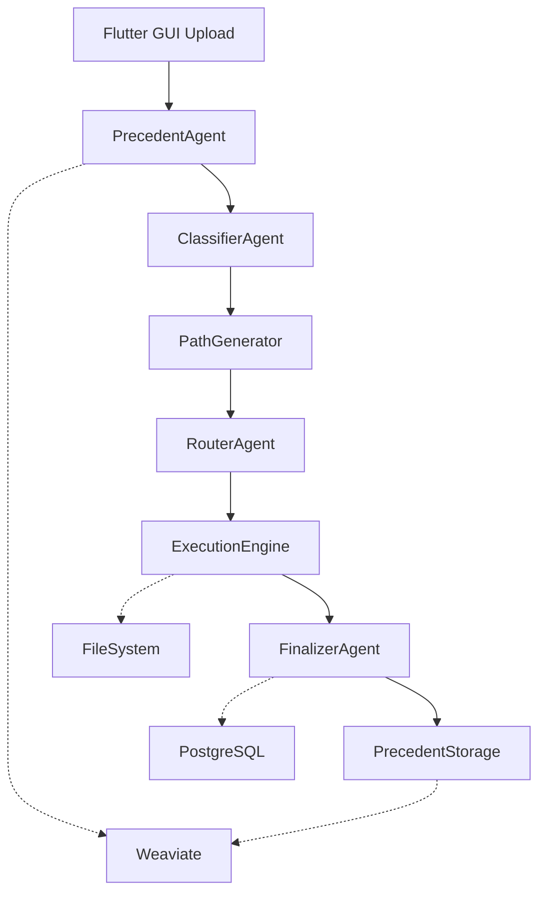

# Genesis AI Assistant

A sophisticated multimodal AI assistant with LangGraph orchestration, Weaviate vector storage, and smart precedent learning. Genesis processes images, audio, documents, and more using locally-hosted OpenAI gpt-oss models through Ollama.

> ⚠️ **Platform Notice**: Genesis has been tested and verified on **Windows 10/11 only**. While the components (Docker, Flutter, Python) are cross-platform, functionality on macOS and Linux has not been tested. Bugs may persist on non-Windows systems.

## What Genesis Can Do

- **AI-Powered Document Processing**: Advanced OCR with PaddleOCR, intelligent text merging, translation, and extraction from images and PDFs
- **Image Processing**: Text removal, inpainting with custom fonts, and intelligent image manipulation
- **Audio Processing**: Noise reduction and audio enhancement using advanced algorithms  
- **Smart Workflow Learning**: Weaviate-powered precedent system that learns from your processing patterns
- **Web Search Integration**: Built-in web search capabilities for enhanced AI responses
- **Real-time Processing**: WebSocket support for live updates and streaming execution
- **Cross-Platform GUI**: Flutter-based interface supporting Windows, macOS, Linux, Web, iOS, and Android
- **Full-Stack Architecture**: Python backend with FastAPI, Flutter frontend with Dart

## Quick Start Guide

[**🎬 Watch the Genesis Demo →**](https://youtu.be/32crjY-VhK8)

### Step 1: Install Prerequisites

#### Required Software
1. **[Ollama](https://ollama.com/download)** - Download and install for your operating system
2. **[Docker Desktop](https://www.docker.com/products/docker-desktop/)** - Install Docker and Docker Compose
3. **[Flutter SDK](https://flutter.dev/docs/get-started/install)** - Required for running the GUI
4. **[Git](https://git-scm.com/downloads)** - For cloning the repository

#### Optional (for local development)
- Python 3.12+ (for backend development)
- Visual Studio Code or Android Studio (for Flutter development)

### Step 2: Clone and Setup Project

```bash
# Clone the repository and switch to aws hackathon
git clone https://github.com/pr0ta9/Genesis.git
git switch aws-hackathon
# make sure you are inside the repository
cd path/to/Genesis

# Make sure Docker is running
docker --version
docker-compose --version
```

### Step 3: Download AI Models

Genesis requires OpenAI's gpt-oss models running through Ollama.

> ✅ **Fully Tested Model**: Genesis has been fully tested and verified with `gpt-oss:20b`. Other models may work but could contain errors or unexpected behavior.

**Install and configure Ollama:**

```bash
# Start Ollama (if not already running)
ollama serve

# In a new terminal, download the AI model
# Option A: gpt-oss:20b (14GB, requires 16GB+ RAM) - RECOMMENDED & FULLY TESTED
ollama pull gpt-oss:20b

# Option B: Larger model (65GB, requires 80GB+ memory) - UNTESTED, may have issues
# ollama pull gpt-oss:120b

# Verify the model downloaded successfully
ollama list
```

**Important Notes:**
- ⏱️ Model download may take 10-30 minutes depending on your internet speed
- 🔄 **Ollama must be running in the background** whenever you use Genesis
- ✅ Use `gpt-oss:20b` for best compatibility (fully tested)
- ⚠️ Other models are untested and may produce errors

### Step 4: Configure Environment

Create your environment files:

#### Create `.env` in project root (Optional):
```env
# === Required Configuration ===
GENESIS_KEEP_WORKSPACE=1
GENESIS_DEV_MODE=0

# === Ollama Configuration (Required) ===
# Ollama must be running in the background: ollama serve
# Tested model: gpt-oss:20b (other models may have errors)
OLLAMA_BASE_URL=http://localhost:11434
```

> 💡 **Note**: API keys for AWS Bedrock, Google AI, OpenAI, etc. are configured through the **Settings page in the GUI**, not in the .env file.

### Step 5: Start Genesis

> 📝 **Note**: The `.bat` launcher scripts are Windows-only. For macOS/Linux, use the manual setup method below.

You have two ways to start Genesis:

#### **Option A: Quick Start (Recommended for Users)** 🚀

***Make sure your docker is opened*** and simply double-click one of the launcher scripts:

- **`run_cpu.bat`** - CPU mode (works on any PC)
- **`run_gpu.bat`** - GPU mode (NVIDIA GPU required, see warning below)
- **`run_dev.bat`** - Development mode with hot reload (NVIDIA GPU required, see warning below)

The launcher will:
1. Start Docker services automatically
2. Wait for backend to be ready
3. Launch the Flutter GUI
4. Stop Docker when you close the GUI

⚠️ **GPU/Dev Mode Requirements:**
- **NVIDIA GPU** with 12GB+ VRAM (RTX 3060 or better)
- **CUDA 12.8** compatible drivers (NOT 11.x or 12.0-12.7)
- **NVIDIA Docker runtime** installed and configured
- **Windows 10/11** 64-bit

If you don't have these exact requirements, use `run_cpu.bat` instead.

---

#### **Option B: Manual Setup (Advanced Users)** ⚙️

If you prefer manual control or need to customize:

**1. Start Backend Services:**

```bash
# CPU mode (standard)
docker-compose up -d

# GPU mode (requires CUDA 12.8 - see warning above)
docker-compose -f docker-compose.gpu.yml up -d

# Development mode with hot reload (requires CUDA 12.8)
docker-compose -f docker-compose.yml -f docker-compose.dev.yml up -d

# View logs
docker-compose logs -f backend
```

**2. Start Flutter GUI:**

```bash
# Navigate to the gui directory
cd gui

# Get Flutter dependencies (first time only)
flutter pub get

# Run the app
flutter run -d windows    # For Windows

# Or build release version
flutter build windows
```

**3. Stop Services:**

```bash
# CPU mode
docker-compose down

# GPU mode
docker-compose -f docker-compose.gpu.yml down

# Dev mode
docker-compose -f docker-compose.yml -f docker-compose.dev.yml down
```

### Step 6: Access Genesis

Once backend is running and Flutter GUI is launched:

- **🌟 Genesis GUI**: Runs as native desktop/mobile/web app
  - Go to **Settings** to configure AI provider API keys (AWS Bedrock, OpenAI, etc.)
- **📚 API Documentation**: http://localhost:8000/docs
- **🔧 Backend API**: http://localhost:8000
- **🗄️ Weaviate Console**: http://localhost:8080/v1

### Step 7: Test Your Setup

1. **Launch the Flutter GUI** and create a new chat
2. **Upload a Test Image**: Use `tests/examples/test.png`
3. **Try OCR**: Ask Genesis to extract text from the image
4. **Test Audio**: Upload `tests/examples/test.wav` and try denoising
5. **Experiment**: Try different combinations of tools and watch real-time execution in the UI

## Available Tools

Genesis provides these AI-powered tools:

### 🖼️ Image Processing
- **OCR**: Extract text from images and PDFs
- **Text Removal**: Intelligently erase text from images
- **Inpainting**: Replace text with custom fonts and styles
- **Translation**: Multi-language text translation

### 🎵 Audio Processing
- **Denoise**: Remove background noise from audio files

### 🌐 Web & Search
- **Web Search**: Search the internet using DuckDuckGo

### 📝 Workflow Examples
- **Document Digitization**: Image → OCR → Translate → Export
- **Image Cleanup**: Image → OCR → Remove Text → Save Clean Image
- **Audio Enhancement**: Audio → Denoise → Download Clean Audio

## How Genesis Works: Data Flow & Integrations

Genesis operates through a sophisticated orchestration system that intelligently processes your files and learns from your workflows:

### 🔄 **Simple Data Flow**


```mermaid
graph TD
    UserUpload[Flutter GUI Upload] --> PrecedentAgent
    PrecedentAgent --> ClassifierAgent
    ClassifierAgent --> PathGenerator
    PathGenerator --> RouterAgent
    RouterAgent --> ExecutionEngine
    ExecutionEngine --> FinalizerAgent
    FinalizerAgent --> PrecedentStorage
    
    PrecedentAgent -.-> Weaviate
    PrecedentStorage -.-> Weaviate
    ExecutionEngine -.-> FileSystem
    FinalizerAgent -.-> PostgreSQL
```

**Step-by-Step Process:**
1. **Input Analysis** → Upload files (images, audio, PDFs) via Flutter GUI
2. **Precedent Lookup** → Search Weaviate vector database for similar past workflows  
3. **Smart Classification** → AI analyzes content type and processing requirements
4. **Path Planning** → Generate optimal tool combinations based on input/output types
5. **Intelligent Routing** → Select best workflow path with learned preferences
6. **Execution** → Run processing tools (OCR, translation, audio processing, etc.)
7. **Real-time Updates** → Stream execution progress back to Flutter GUI via WebSocket
8. **Result Assembly** → Format outputs and save to organized file structure
9. **Learning** → Store successful workflow as precedent for future optimization
## Troubleshooting

### Genesis Won't Start

**Problem**: "Cannot connect to Ollama"

⚠️ **Most Common Issue**: Ollama is not running in the background!

```bash
# Check if Ollama is running
ollama list

# If not running, start it (REQUIRED)
ollama serve

# In a new terminal, verify your model is available
ollama list | grep gpt-oss

# Make sure you're using the tested model
# Should show: gpt-oss:20b
```

**Solution**: Ollama MUST be running before starting Genesis. Keep `ollama serve` running in the background.

**Problem**: "Flutter GUI can't connect to backend"
```bash
# Check if backend is running
docker-compose logs backend

# Verify backend is accessible
curl http://localhost:8000/health

# Check Flutter config (should point to http://localhost:8000)
# Edit gui/lib/core/config.dart if needed

# Restart services
docker-compose restart
```

**Problem**: Docker containers keep stopping
```bash
# Check Docker logs
docker-compose logs

# Make sure you have enough RAM (16GB+ recommended)
# Set GENESIS_DEV_MODE=0 in .env to prevent auto-reload issues
```

### Performance Issues

**Slow Processing**: 
- Ensure you're using the 20B model (not 120B) unless you have 80GB+ RAM
- Close other memory-intensive applications
- Consider using CPU mode instead of GPU mode

**First Run Slow**: 
- PaddleOCR models download on first OCR/translation use
- Subsequent runs will be much faster

### Flutter GUI Issues

**Problem**: "Flutter not found"
```bash
# Verify Flutter installation
flutter doctor

# If issues found, follow Flutter's setup guide
flutter doctor -v
```

**Problem**: "Dependencies failed to resolve"
```bash
cd gui
flutter clean
flutter pub get
```

**Problem**: "Platform not available"
```bash
# Check available devices
flutter devices

# Enable desktop support if needed
flutter config --enable-windows-desktop
flutter config --enable-macos-desktop
flutter config --enable-linux-desktop
```

### Getting Help

1. **Check logs**: `docker-compose logs -f`
2. **Verify setup**: Ensure Ollama is running with `ollama list`
3. **Restart services**: `docker-compose restart`
4. **Clean start**: `docker-compose down && docker-compose up -d`

## Advanced Configuration

### Vector Database (Weaviate)

Genesis uses Weaviate for vector storage and precedent learning:

- **Automatic Setup**: Weaviate runs automatically via Docker Compose
- **Data Persistence**: All precedent data is stored in Docker volumes
- **No Manual Configuration**: Everything is pre-configured to work locally
- **Access Console**: View stored precedents at http://localhost:8080/v1

### AI Provider Configuration

Genesis supports multiple AI providers. Configure via the **Settings page in the GUI**:

#### Local Models (Recommended)
- **Ollama** (Default): Free, runs locally, privacy-focused
  - ✅ **Fully tested** with `gpt-oss:20b`
  - ⚠️ **Must be running**: Start `ollama serve` and open docker before launching Genesis
  - Auto-detected at `http://localhost:11434`

#### Cloud AI Providers (Optional)
Configure these through **GUI Settings → Provider Settings**:

- **AWS Bedrock**: Access to Claude, Llama, and other models
  - Add your AWS access key, secret key, and region in GUI settings

- **Other Providers**: Additional providers can be configured in GUI settings

> 💡 **Tip**: All API keys are stored securely and configured through the GUI Settings page - no need to edit configuration files.

### Development Mode

For developers who want to modify Genesis:

```bash
# Enable development mode with hot reload
# Set in .env: GENESIS_DEV_MODE=1

# Or run development compose
docker-compose -f docker-compose.yml -f docker-compose.dev.yml up -d
```

## System Requirements

> ⚠️ **Tested Platform**: Genesis has only been tested on **Windows 10/11 64-bit**. While Docker, Flutter, and Python are cross-platform, macOS and Linux compatibility is untested and may have bugs.

### Minimum Requirements (Recommended Setup)
- **RAM**: 16GB (for gpt-oss:20b model)
- **Storage**: 20GB free space
- **CPU**: Any modern CPU with AVX2 support
- **OS**: Windows 10/11 64-bit (tested), macOS/Linux (untested)

### High-Performance Setup
- **RAM**: 32GB+ 
- **Storage**: SSD with 50GB+ free space
- **CPU**: Multi-core processor (8+ cores recommended)

### GPU Requirements (For GPU/Dev Mode)
⚠️ **Important**: GPU mode (`run_gpu.bat`, `run_dev.bat`) requires **exact** specifications:
- **GPU**: NVIDIA GPU with 12GB+ VRAM (RTX 3060 or better)
- **CUDA**: **Exactly CUDA 12.8** compatible drivers
  - ❌ NOT supported: CUDA 11.x, 12.0-12.7, 12.9+
  - ✅ Only CUDA 12.8 works
- **RAM**: 24GB+ system RAM recommended
- **Docker**: NVIDIA Docker runtime installed and configured
- **OS**: Windows 10/11 64-bit

If you cannot meet these exact requirements, use CPU mode (`run_cpu.bat`) instead - it works on any PC.

## Support & Contributing

### Getting Support

**Before Asking for Help:**
1. Check the troubleshooting section above
2. Review Docker logs: `docker-compose logs`
3. Ensure all prerequisites are properly installed
4. Verify Ollama is running: `ollama list`
5. Confirm you're using `gpt-oss:20b` (fully tested model)

**Report Bugs:**
If you encounter errors or unexpected behavior:
1. Check that you're using the tested configuration:
   - ✅ Windows 10/11
   - ✅ Ollama with `gpt-oss:20b`
   - ✅ Latest version of Genesis
2. Submit a detailed bug report on [GitHub Issues](https://github.com/yourusername/genesis/issues)
   - Include error messages
   - Include your system specs
   - Include steps to reproduce
3. We'll investigate and help resolve the issue

> 💡 **Tip**: Most issues are resolved by ensuring Ollama is running (`ollama serve`) and using the tested `gpt-oss:20b` model.

### Contributing
1. Fork the repository
2. Create a feature branch (`git checkout -b feature/amazing-feature`)
3. Test your changes thoroughly
4. Commit your changes (`git commit -m 'Add amazing feature'`)
5. Push to the branch (`git push origin feature/amazing-feature`)
6. Open a Pull Request

## Distribution (Portable Package)

Genesis can be packaged and distributed as a portable application (similar to ComfyUI).

> ⚠️ **Windows Only**: The `.bat` launchers and packaging instructions are for Windows. macOS/Linux users should use the manual setup method.

### For Distributors

1. **Prepare the package:**
   ```bash
   # Stop any running containers
   docker-compose down
   ```

2. **Create ZIP:**
   - Zip the entire Genesis folder
   - Name it: `Genesis-v1.0-Windows.zip` (or your version)

3. **Share the ZIP file** with users

> 💡 **Note**: Users configure API keys through the GUI Settings page - no .env file needed for distribution.

### For End Users

**Prerequisites (one-time install):**
- **OS**: Windows 10/11 64-bit (only tested platform)
- [Docker Desktop](https://www.docker.com/products/docker-desktop) - Required
- [Flutter SDK](https://flutter.dev/docs/get-started/install/windows) - Required
- For GPU mode: NVIDIA GPU with CUDA 12.8 drivers

**Installation:**
1. Extract `Genesis-v1.0-Windows.zip` to any folder
2. Double-click `run_cpu.bat` to start
3. (Optional) Configure API keys in GUI Settings page after first launch

**First Run:**
- Docker will download images (~2-3GB, takes 10-20 minutes)
- Subsequent runs are much faster (~20-30 seconds)

**Usage:**
- CPU mode: Double-click `run_cpu.bat`
- GPU mode: Double-click `run_gpu.bat` (requires CUDA 12.8)
- Dev mode: Double-click `run_dev.bat` (requires CUDA 12.8)

**Stopping:**
Simply close the Flutter GUI window - Docker containers stop automatically.

## License

This project is licensed under the Apache 2.0 License. The OpenAI gpt-oss models are also licensed under Apache 2.0.

---

## Project Structure (For Developers)

```
Genesis/
├── 📱 Frontend (Flutter + Dart)
│   ├── gui/
│   │   ├── lib/                     # Main application code
│   │   │   ├── main.dart            # Application entry point
│   │   │   ├── layout.dart          # Root layout with sidebar & panels
│   │   │   ├── core/                # Core configuration
│   │   │   │   └── config.dart      # App configuration settings
│   │   │   ├── data/                # Data layer
│   │   │   │   ├── models/          # Data models
│   │   │   │   │   ├── ai_model.dart        # AI model configuration
│   │   │   │   │   ├── chat_message.dart    # Message data model
│   │   │   │   │   └── file_attachment.dart # File attachment model
│   │   │   │   └── services/        # Business logic services
│   │   │   │       ├── artifact_service.dart   # Artifact management
│   │   │   │       ├── chat_service.dart       # Chat API client
│   │   │   │       ├── model_service.dart      # AI model configuration
│   │   │   │       ├── precedent_service.dart  # Precedent management
│   │   │   │       └── streaming_service.dart  # WebSocket streaming
│   │   │   └── widgets/             # UI components
│   │   │       ├── chat/            # Chat interface components
│   │   │       │   ├── chat_input.dart       # Message input field
│   │   │       │   ├── chat_message.dart     # Individual message display
│   │   │       │   ├── drag_drop_handler.dart # File drag & drop
│   │   │       │   ├── message_reasoning.dart # AI reasoning display
│   │   │       │   ├── sidebar.dart          # Chat list sidebar
│   │   │       │   └── summary_card.dart     # Execution summary cards
│   │   │       ├── chat_panel.dart  # Main chat interface panel
│   │   │       ├── execution_panel.dart # Real-time execution tracking
│   │   │       ├── execution/       # Execution visualization components
│   │   │       │   ├── code_block.dart   # Code syntax display
│   │   │       │   ├── console.dart      # System output console
│   │   │       │   ├── pipeline.dart     # Processing pipeline display
│   │   │       │   ├── preview.dart      # Generic file preview
│   │   │       │   └── propagation.dart  # Path propagation visualization
│   │   │       ├── previews/        # File preview components
│   │   │       │   ├── audio_preview.dart    # Audio file playback
│   │   │       │   ├── document_preview.dart # Document viewer
│   │   │       │   ├── file_preview.dart     # File preview router
│   │   │       │   ├── image_preview.dart    # Image viewer
│   │   │       │   └── video_preview.dart    # Video player
│   │   │       ├── settings_page.dart # Settings & configuration page
│   │   │       └── common/          # Shared components
│   │   │           ├── health_check.dart       # Backend health monitoring
│   │   │           ├── model_selector.dart     # AI model selection widget
│   │   │           └── resizable_divider.dart  # Resizable panel divider
│   │   ├── assets/                  # Static assets
│   │   │   └── genesis.svg          # Application logo
│   │   ├── android/                 # Android platform configuration
│   │   ├── ios/                     # iOS platform configuration
│   │   ├── linux/                   # Linux platform configuration
│   │   ├── macos/                   # macOS platform configuration
│   │   ├── windows/                 # Windows platform configuration
│   │   ├── web/                     # Web platform configuration
│   │   ├── pubspec.yaml             # Flutter dependencies & configuration
│   │   ├── pubspec.lock             # Locked dependency versions
│   │   ├── analysis_options.yaml    # Dart analyzer configuration
│   │   └── README.md                # GUI setup documentation
│
├── 🔧 Backend (FastAPI + Python)
│   ├── src/
│   │   ├── main.py              # FastAPI application entry point
│   │   ├── api/                 # REST API endpoints
│   │   │   ├── chat.py          # Conversation management endpoints
│   │   │   ├── message.py       # Message handling & streaming endpoints
│   │   │   ├── artifact.py      # Artifact management endpoints
│   │   │   ├── model.py         # AI model configuration endpoints
│   │   │   └── precedent.py     # Precedent storage & retrieval endpoints
│   │   ├── db/                  # Database layer
│   │   │   ├── database.py      # Database connection & setup
│   │   │   ├── model.py         # SQLAlchemy/ORM models
│   │   │   ├── client.py        # RAG client setup & schema creation
│   │   │   ├── crud.py          # Database CRUD operations
│   │   │   ├── semantics.py     # RAG search/storage operations
│   │   │   └── migrations.py    # Database migrations
│   │   └── orchestrator/        # Core orchestration logic (see below)
│   ├── data/
│   │   └── font/                # Font files for text processing
│   │       ├── NotoSans-Regular.ttf         # Default sans-serif font
│   │       └── SourceHanSerifK-Regular.otf  # Korean serif font
│   ├── inputs/                  # User file uploads (organized by conversation)
│   ├── outputs/                 # Processing results (organized by conversation)
│   ├── tmp/                     # Temporary processing files
│   ├── main.py                  # Backend server entry point
│   ├── requirements-common.txt  # Shared Python dependencies
│   ├── requirements-cpu.txt     # CPU-only dependencies
│   ├── requirements-gpu.txt     # GPU-accelerated dependencies
│   └── README.md                # Project documentation
│
│
├── 🧠 Orchestrator (LangGraph Workflow Engine)
│   ├── src/orchestrator/              # All orchestration logic
│   │   ├── core/                      # Core orchestration components
│   │   │   ├── orchestrator.py        # Main LangGraph workflow coordinator
│   │   │   ├── state.py               # LangGraph state definitions
│   │   │   └── logging_utils.py       # Logging & debugging utilities
│   │   ├── agents/                    # AI agents for workflow management
│   │   │   ├── base_agent.py          # Abstract base agent class
│   │   │   ├── precedent.py           # Precedent analysis & lookup agent
│   │   │   ├── classifier.py          # Input classification & objective setting
│   │   │   ├── router.py              # Path selection & routing decisions
│   │   │   ├── finalizer.py           # Result processing & response generation
│   │   │   ├── llm.py                 # LLM setup & configuration
│   │   │   └── prompts/               # YAML prompt templates
│   │   │       ├── Classifier.yaml
│   │   │       ├── Router.yaml
│   │   │       ├── Finalizer.yaml
│   │   │       ├── Precedent.yaml
│   │   │       └── JsonRepair.yaml
│   │   ├── path/                      # Path planning & type system
│   │   │   ├── metadata.py            # WorkflowType & FileType type system
│   │   │   ├── models.py              # PathItem & execution models
│   │   │   ├── decorators.py          # @genesis_tool decorator
│   │   │   ├── registry.py            # Tool discovery & indexing
│   │   │   └── generator.py           # DFS path planning
│   │   ├── executor/                  # Path execution engine
│   │   │   ├── flow_state.py          # StateGenerator for TypedDict schemas
│   │   │   ├── conversion.py          # StateGraph conversion & compilation
│   │   │   ├── execution.py           # GraphExecutor & ExecutionOrchestrator
│   │   │   └── process_isolation.py   # Process isolation
│   │   ├── tools/                     # Processing tool implementations
│   │   │   ├── path_tools/            # Type transformation tools
│   │   │   │   ├── ocr.py             # Optical character recognition
│   │   │   │   ├── translate.py       # Text translation
│   │   │   │   ├── erase.py           # Image object removal
│   │   │   │   ├── inpaint_text.py    # Text inpainting on images
│   │   │   │   ├── denoise.py         # Image denoising
│   │   │   │   └── object_types/      # Custom object type definitions
│   │   │   │       └── image_text.py  # Image-text type handling
│   │   │   └── agent_tools/           # Utility tools
│   │   │       └── web_search.py      # Web search integration
│   │   ├── stream/                    # Streaming support
│   │   │   └── stream.py              # Real-time execution streaming
│   │   └── __init__.py                # Package initialization
│
├── 🐳 Deployment & Configuration
│   ├── docker-compose.yml       # Main deployment configuration (CPU mode)
│   ├── docker-compose.gpu.yml   # GPU-accelerated variant (CUDA 12.8)
│   ├── docker-compose.dev.yml   # Development mode with hot reload
│   ├── Dockerfile               # Backend container definition (CPU)
│   ├── Dockerfile.gpu-cuda12    # GPU-optimized container (CUDA 12.8)
│   ├── run_cpu.bat              # Windows launcher - CPU mode
│   ├── run_gpu.bat              # Windows launcher - GPU mode
│   ├── run_dev.bat              # Windows launcher - Dev mode
│   ├── requirements-common.txt  # Shared Python dependencies
│   ├── requirements-cpu.txt     # CPU-only dependencies
│   ├── requirements-gpu.txt     # GPU-accelerated dependencies
│   └── .env                     # Environment configuration (optional)
│
└── 📁 Workspace & Documentation
    ├── inputs/                  # User file uploads (organized by conversation)
    ├── outputs/                 # Processing results (organized by conversation)
    ├── tmp/                     # Temporary processing files
    ├── db/                      # Local database files
    ├── README.md                # Main project documentation
    └── LICENSE                  # Apache 2.0 license
```